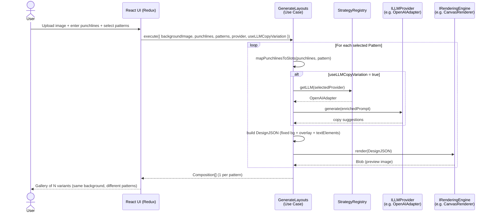

# Zen Media Crafter: Architecture

**Author:** Toan  
**Last Updated:** 2026-02-28  
**Skills Applied:** `architecture-patterns`, `design-patterns-implementation`, `architecture-decision-records`

---

## 1. Overview

Zen Media Crafter is a **local-first**, **privacy-preserving** tool for generating high-quality media assets (memes, banners, ads, promos) using user-provided images and AI-generated layouts.

The system is built on **Hexagonal Architecture (Ports & Adapters)** combined with the **Strategy Pattern** to ensure that:
- LLM providers (OpenAI, Gemini, Ollama…) are plug-and-play
- Rendering engines (Canvas, SVG, Node-Canvas…) are interchangeable
- The Domain Core is **framework-free** and 100% unit-testable without any external service

> See [ADR-0001](adr/0001-hexagonal-strategy.md) for the decision rationale.

---

## 2. Tech Stack

| Layer | Technology | Rationale |
|---|---|---|
| **Framework** | Next.js 16 (App Router) | SSR support for Node-Canvas server-side rendering; file-based routing |
| **UI** | React 19 + Material UI | Component model; MUI for rapid, consistent UI |
| **State** | Redux Toolkit | Global state for API keys, project history, UI |
| **LLM** | Vercel AI SDK | Unified abstraction over OpenAI, Gemini, Ollama |
| **Rendering** | Canvas API / SVG / Node-Canvas | Client and server-side rendering strategies |
| **Testing (Unit)** | Vitest | Fast, ESM-native, compatible with Next.js |
| **Testing (E2E)** | Playwright | Full workflow testing |
| **Validation** | Zod | Runtime schema validation at port boundaries |
| **Language** | TypeScript (strict) | Type safety across all layers |

---

## 3. Hexagonal Architecture

```
┌─────────────────────────────────────────────────────────────┐
│                         DOMAIN CORE                         │
│   Entities: Project, Composition, DesignJSON, UserAsset     │
│             Pattern, PunchlineSet                           │
│   Use Cases: GenerateLayouts, TweakElement, ExportAsset     │
│             MapPunchlinesToSlots                            │
│   (Zero framework deps — pure TypeScript)                   │
├──────────────────┬──────────────────────────────────────────┤
│  PRIMARY PORTS   │          SECONDARY PORTS                 │
│  (Driving)       │          (Driven)                        │
│  ILayoutCommand  │  ILLMProvider · IRenderingEngine         │
│  ITweakCommand   │  IExporter · IAssetRepository            │
├──────────────────┼──────────────────────────────────────────┤
│ PRIMARY ADAPTERS │       SECONDARY ADAPTERS                 │
│ Next.js API      │  OpenAIAdapter · GeminiAdapter           │
│ React UI (Redux) │  OllamaAdapter                           │
│                  │  CanvasRenderer · SVGRenderer            │
│                  │  NodeCanvasRenderer (SSR)                │
│                  │  FileExporter · CloudExporter            │
└──────────────────┴──────────────────────────────────────────┘
```

### 3.1 Domain Core

The center of the hexagon. **No imports from React, Next.js, or any LLM SDK.**

| Entity | Description |
|---|---|
| `Project` | Root aggregate. Owns a list of `Composition` objects. |
| `Composition` | A single variant (meme/banner). Owns a `DesignJSON`. |
| `DesignJSON` | Universal intermediate format describing canvas + elements + overlay. |
| `UserAsset` | A user-uploaded image reference (ID + metadata). |
| `Pattern` | Visual style template (overlay, text slots, typography). One variant generated per selected pattern. |
| `PunchlineSet` | Structured copy input: headline, sub-headline, CTA, caption + content type. |

Use Cases:
- `GenerateLayouts` — maps `PunchlineSet` onto each selected `Pattern`'s text slots, optionally calls `ILLMProvider` for copy variation, produces 1 `Composition` per pattern
- `MapPunchlinesToSlots` — pure function; distributes structured copy into pattern layout zones
- `TweakElement` — mutates a single element in a `DesignJSON` without re-generating
- `ExportAsset` — calls `IRenderingEngine` → `IExporter` to produce a downloadable file

### 3.2 Ports (Interfaces)

```typescript
// src/ports/i-llm-provider.ts
export interface ILLMProvider {
  readonly id: string;
  generateDesign(prompt: string, assets: UserAsset[]): Promise<DesignJSON>;
}

// src/ports/i-rendering-engine.ts
export interface IRenderingEngine {
  readonly id: string;
  render(design: DesignJSON): Promise<Blob | Buffer>;
}

// src/ports/i-exporter.ts
export interface IExporter {
  export(rendered: Blob | Buffer, filename: string): Promise<void>;
}
```

### 3.3 Strategy Registry

```typescript
// src/registry/strategy-registry.ts
export class StrategyRegistry {
  private static instance: StrategyRegistry;
  private llmProviders = new Map<string, ILLMProvider>();
  private renderEngines = new Map<string, IRenderingEngine>();

  static getInstance(): StrategyRegistry { ... }

  registerLLM(provider: ILLMProvider): void { ... }
  getLLM(id: string): ILLMProvider { ... }

  registerRenderer(engine: IRenderingEngine): void { ... }
  getRenderer(id: string): IRenderingEngine { ... }
}
```

The registry is a **Singleton** and is wired at application startup (Next.js `instrumentation.ts` or a server action initializer).

---

## 4. Data Flow



---

## 5. DesignJSON Schema

> See [ADR-0002](adr/0002-design-json-schema.md) for the full contract definition and versioning strategy.

```json
{
  "version": "1.0",
  "canvas": { "width": 1080, "height": 1080 },
  "background": { "type": "image", "src": "user-asset-id" },
  "overlay": { "type": "solid", "value": "#0d1117", "opacity": 0.7 },
  "elements": [
    {
      "id": "uuid-v4",
      "type": "image",
      "src": "user-asset-id",
      "transform": { "scale": 1.0, "rotation": 0, "opacity": 1.0 },
      "position": { "x": 0, "y": 0 },
      "layer": 1
    },
    {
      "id": "uuid-v4",
      "type": "text",
      "content": "Summer Sale",
      "style": { "fontSize": 64, "color": "#ffffff", "fontFamily": "Inter", "fontWeight": "extrabold" },
      "position": { "x": 80, "y": 200, "zone": "top-left" },
      "layer": 3
    }
  ]
}
```

> **Layer convention:** `1` = background image, `2` = reserved for overlay, `3+` = text/accent elements.
> **`overlay`** is a new optional field added in v1.0 non-breaking extension — see [ADR-0002](adr/0002-design-json-schema.md).

---

## 6. Redux State Shape

```typescript
interface RootState {
  apiKeys: {
    openai: string | null;
    gemini: string | null;
    anthropic: string | null;
  };
  project: {
    id: string;
    name: string;
    compositions: Composition[];
    selectedCompositionId: string | null;
  };
  ui: {
    isGenerating: boolean;
    selectedLLMProvider: string;
    selectedRenderer: string;
    sidebarOpen: boolean;
  };
  patterns: {
    availablePatterns: Pattern[];     // built-in + user-created
    selectedPatternIds: string[];      // drives variant count (1 per pattern)
    customPatterns: Pattern[];         // user-defined, persisted to localStorage
  };
  generationInput: {
    backgroundImageId: string | null;  // fixed across all variants
    punchlines: PunchlineSet;          // headline, subheadline, CTA, caption + contentType
    useLLMCopyVariation: boolean;      // false = template-only (offline); true = LLM-assisted
  };
  history: {
    past: Project[];
    future: Project[];
  };
}
```

> The `patterns` and `generationInput` slices are the primary input surface. `project.compositions` holds the generated output.

---

## 7. TDD Strategy

> See [ADR-0003](adr/0003-tdd-approach.md) for the formal decision.  
> All features follow the **Red → Green → Refactor** cycle per the `test-driven-development` skill.

| Layer | Tool | Location | Focus |
|---|---|---|---|
| **Domain Core** | Vitest (unit) | `src/__tests__/core/` | Entities, use cases — no mocks |
| **Ports + Adapters** | Vitest (integration) | `src/__tests__/adapters/` | Adapter contracts via mock ports |
| **Registry** | Vitest (unit) | `src/__tests__/registry/` | Registration, retrieval, singleton |
| **UI** | Vitest + React Testing Library | `src/__tests__/ui/` | Component behavior |
| **E2E** | Playwright | `tests/e2e/` | Full generation + download workflows |

**Coverage gate:** 80% minimum for `src/core/` and `src/ports/`. Adapters: 60%.

---

## 8. Next.js Integration

```
app/
  layout.tsx              # Root layout (MUI ThemeProvider, Redux Provider)
  page.tsx                # Landing / upload page
  generate/
    page.tsx              # Generation workflow
  gallery/
    page.tsx              # Results gallery
  api/
    generate/route.ts     # Server Action: calls GenerateLayouts use case
    export/route.ts       # Server Action: calls ExportAsset use case (Node-Canvas)
instrumentation.ts        # Registers all adapters into StrategyRegistry at startup
```

> Next.js App Router enables **server-side rendering** for Node-Canvas (heavy rendering offloaded from browser), while client-side Canvas/SVG is used for live previews.

---

## 9. Extension Points

Adding a new LLM provider:
1. Create `src/adapters/llm/my-provider-adapter.ts` implementing `ILLMProvider`
2. Register it in `instrumentation.ts`
3. Add it to the `ui.selectedLLMProvider` enum in Redux

Adding a new renderer:
1. Create `src/adapters/renderers/my-renderer.ts` implementing `IRenderingEngine`
2. Register it in `instrumentation.ts`
3. Add it to the `ui.selectedRenderer` enum in Redux

**Zero changes to Domain Core required.** ✅
